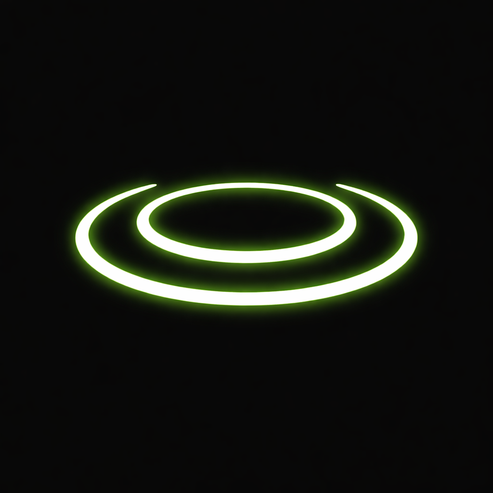

<p align="center">
  
</p>

<h1 align="center">nocnoc</h1>

<p align="center">
  Knock on your MacBook to trigger actions — no touch, no click.
</p>

<p align="center">
  
  
  
</p>

---

## How It Works

1. Launch nocnoc — it appears in the menu bar and as a dashboard window
2. Knock on your MacBook chassis (lid or palm rest)
3. The built-in accelerometer detects the knock pattern
4. Your configured action runs automatically

Single, double, and triple knock patterns are each mapped to different actions.

## Features

- **Knock detection** — uses the MacBook's built-in SPU accelerometer to detect chassis taps
- **Pattern recognition** — distinguishes single, double, and triple knock patterns
- **Configurable actions** — toggle mute, lock screen, launch apps, run Shortcuts, shell commands
- **Real-time waveform** — live accelerometer visualization in the dashboard
- **Calibration wizard** — guided setup to tune sensitivity for your knock style
- **Adjustable parameters** — threshold, grouping window, cooldown, waveform gain
- **Menu bar + dashboard** — quick access from the menu bar, full controls in the window

## Requirements

- Apple Silicon Mac (M1/M2/M3/M4)
- macOS 15+
- Hardware with `AppleSPUHIDDevice` (MacBook Pro, MacBook Air)

## Installation

### From Source

```bash
git clone https://github.com/shaircast/nocnoc.git
cd nocnoc
swift run
```

### Build as .app

```bash
./scripts/build.sh
open dist/nocnoc.app
```

To produce a signed, notarized release build, set `APPLE_CODESIGN_IDENTITY` and `APPLE_NOTARY_PROFILE` before running the script.

## Default Actions

| Pattern | Action |
|---|---|
| Single knock | Toggle Mute |
| Double knock | Lock Screen |
| Triple knock | Run Shortcut |

All actions are configurable in the dashboard.

## Available Actions

| Category | Actions |
|---|---|
| System Controls | Toggle Mute, Lock Screen, Brightness Up/Down, Volume Up/Down |
| Apps & Shortcuts | Launch App, Run Shortcut |
| Advanced | Terminal Command, Do Nothing |

## Tech Stack

| Component | Technology |
|---|---|
| UI | SwiftUI (WindowGroup + MenuBarExtra) |
| Sensor | IOKit HID (`AppleSPUHIDDevice`) |
| Actions | osascript, Shortcuts CLI, Process API |
| Build | Swift Package Manager |

## Note

This app uses the private `AppleSPUHIDDevice` API, not the public `CoreMotion` framework. It requires hardware that exposes this sensor — generally MacBook Pro and MacBook Air with Apple Silicon.

## License

MIT
