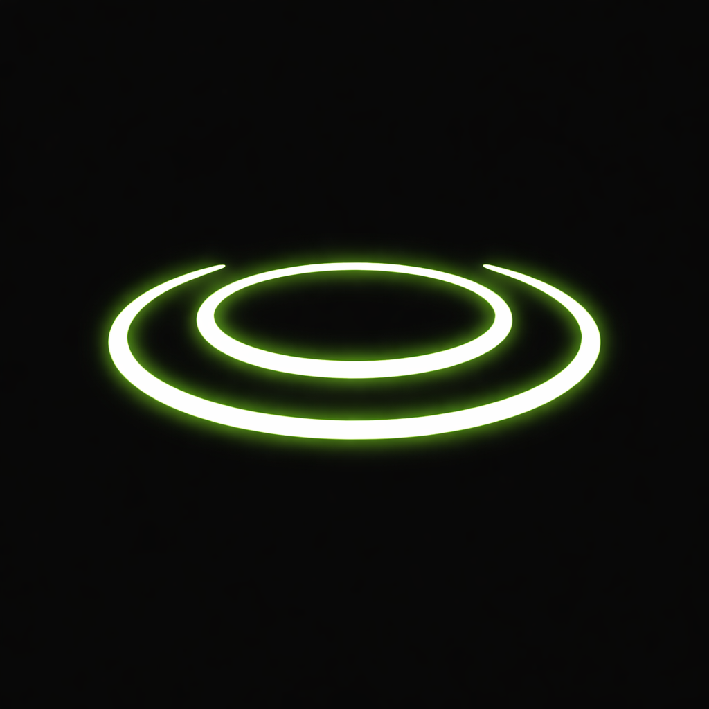

<p align="center">
  
</p>

<h1 align="center">nocnoc</h1>

<p align="center">
  Knock on your MacBook to trigger actions — no touch, no click.
</p>

<p align="center">
  
  
  
</p>

---

## How It Works

1. Launch nocnoc — it appears in the menu bar and as a dashboard window
2. Knock on your MacBook chassis (lid or palm rest)
3. The built-in accelerometer detects the knock pattern
4. Your configured action runs automatically

Single, double, and triple knock patterns are each mapped to different actions.

## Features

- **Knock detection** — uses the MacBook's built-in SPU accelerometer to detect chassis taps
- **Pattern recognition** — distinguishes single, double, and triple knock patterns
- **Configurable actions** — toggle mute, lock screen, launch apps, run Shortcuts, shell commands
- **Real-time waveform** — live accelerometer visualization in the dashboard
- **Calibration wizard** — guided setup to tune sensitivity for your knock style
- **Adjustable parameters** — threshold, grouping window, cooldown, waveform gain
- **Menu bar + dashboard** — quick access from the menu bar, full controls in the window
- **In-app updates** — Sparkle checks for releases and downloads and installs updates

## Requirements

- Apple Silicon Mac (M1/M2/M3/M4)
- macOS 15+
- Hardware with `AppleSPUHIDDevice` (MacBook Pro, MacBook Air)

## Installation

Download `nocnoc.dmg` from the [latest release](https://github.com/shaircast/nocnoc/releases/latest), then drag nocnoc into Applications.

Version 1.0.3 introduces Sparkle. Users on 1.0.2 or earlier need to install this version manually once; later updates can be installed from inside the app.

### From Source

Building requires Swift 6.0 or later and the macOS 15 SDK or later (Xcode 16+). Check `swift --version` and `xcrun --sdk macosx --show-sdk-version` if the build reports a tools-version or macOS platform error. Select a compatible Xcode installation with `DEVELOPER_DIR` if multiple toolchains are installed.

```bash
git clone https://github.com/shaircast/nocnoc.git
cd nocnoc
./scripts/build.sh --unsigned
```

The script builds `dist/nocnoc.app` with its embedded Sparkle framework. It does not launch the app. This local mode applies an ad-hoc signature without accessing the Keychain and skips Developer ID signing, notarization, and release archives; Swift Package Manager downloads dependencies as needed.

Sparkle requires an application bundle to update the app. Running the bare Swift executable is only useful for development; update checking is disabled outside a `.app` bundle.

On first use, macOS may ask you to allow Accessibility access for actions that simulate system key presses, such as Lock Screen, Brightness Up/Down, and custom keyboard shortcuts.

### Release Builds and Sparkle

The public update-signing key is committed in `sparkle-public-key.txt` and embedded as `SUPublicEDKey`. Its private key belongs in the signing Mac's login Keychain under account `com.saturnstudio.nocnoc.sparkle`; it must not be committed to the repository. Back up this private key securely. When moving to another signing Mac, restore that same key with Sparkle's `generate_keys --account com.saturnstudio.nocnoc.sparkle -f /secure/path/to/key` after `swift package resolve`. Sparkle's tools are in `.build/artifacts/sparkle/Sparkle/bin`. The release scripts check that the Keychain's public key matches the app before signing updates.

For each release:

1. Increase both `VERSION` and `BUILD_NUMBER` in `scripts/build.sh`. Sparkle compares the incrementing build number.
2. Configure a Developer ID signing identity and a saved `notarytool` Keychain profile, then run:

   ```bash
   APPLE_CODESIGN_IDENTITY="Developer ID Application: Your Name (TEAMID)" \
   APPLE_NOTARY_PROFILE="your-notary-profile" \
   ./scripts/build.sh
   ```

3. Upload `dist/nocnoc.zip`, `dist/nocnoc.dmg`, and `dist/appcast.xml` together to the GitHub release tagged `vVERSION`, and mark it as the latest release. The scripts prepare files locally and do not publish them.

The build script signs Sparkle's nested helpers, framework, and app, notarizes the app, and recreates the ZIP after stapling its ticket. It then prepares the notarized DMG and signs the final ZIP's appcast entry with Sparkle's Ed25519 key. The appcast itself is also signed, while the app retains Sparkle's default validation policy: signed feeds are not required. To regenerate only the appcast from an existing release ZIP, run `./scripts/generate-appcast.sh dist/nocnoc.zip`; do not alter the archive after generating its signature.

The app checks `https://github.com/shaircast/nocnoc/releases/latest/download/appcast.xml` every four hours by default. Each feed points to the immutable `releases/download/vVERSION/nocnoc.zip` URL for that release. Publish all three files before marking a release as latest so the feed and archive are available together. The initial 1.0.3 release must include the feed to enable future in-app updates.

See Sparkle's [integration guide](https://sparkle-project.org/documentation/), [manual code-signing instructions](https://sparkle-project.org/documentation/sandboxing/#code-signing), and [publishing guide](https://sparkle-project.org/documentation/publishing/) for framework and signing details.

## Default Actions

| Pattern | Action |
|---|---|
| Single knock | Toggle Mute |
| Double knock | Lock Screen |
| Triple knock | Run Shortcut |

All actions are configurable in the dashboard.

## Available Actions

| Category | Actions |
|---|---|
| System Controls | Toggle Mute, Lock Screen, Brightness Up/Down, Volume Up/Down |
| Apps & Shortcuts | Launch App, Run Shortcut |
| Advanced | Terminal Command, Do Nothing |

## Tech Stack

| Component | Technology |
|---|---|
| UI | SwiftUI (WindowGroup + MenuBarExtra) |
| Sensor | IOKit HID (`AppleSPUHIDDevice`) |
| Actions | osascript, Shortcuts CLI, Process API |
| Build | Swift Package Manager |
| Updates | Sparkle 2 (signed appcast and update archives) |

## Note

This app uses the private `AppleSPUHIDDevice` API, not the public `CoreMotion` framework. It requires hardware that exposes this sensor — generally MacBook Pro and MacBook Air with Apple Silicon.

## License

MIT
